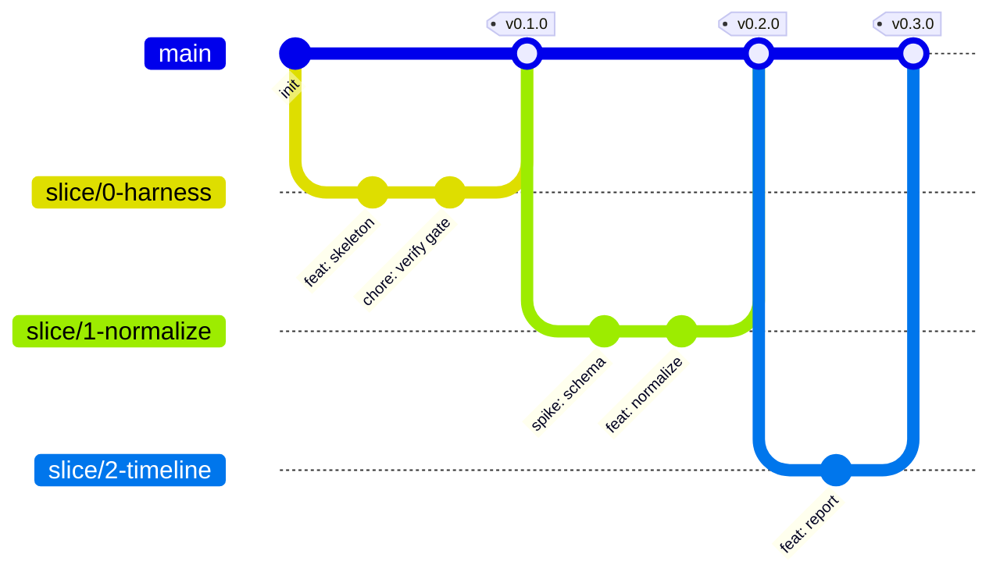

# Glassbox Development Workflow

Lightweight trunk-based workflow for a small/solo project. `main` is always green and releasable.

## Branching strategy

- **`main`** — protected, always passes the verify gate, always releasable.
- **One short-lived branch per slice**, cut from `main`:

  | Slice | Branch | Release tag |
  |---|---|---|
  | 0 | `slice/0-harness` | `v0.1.0` |
  | 1 | `slice/1-normalize` | `v0.2.0` |
  | 2 | `slice/2-timeline` | `v0.3.0` |
  | 3 | `slice/3-metrics` | `v0.4.0` |
  | 4 | `slice/4-redaction` | `v0.5.0` |
  | 5 | `slice/5-compare` | `v1.0.0` |

- **Ad-hoc branches:** `fix/<short-desc>`, `chore/<short-desc>`, `docs/<short-desc>`.
- Keep branches small and short-lived. Rebase on `main` rather than long-running divergence.

## Commit conventions (Conventional Commits)

```
<type>(<optional scope>): <summary>     # imperative, <= 72 chars

[optional body — what & why, plus BRD/TSD trace IDs, e.g. "Implements BR-04, AC-03"]
```

Types: `feat`, `fix`, `test`, `docs`, `chore`, `refactor`, `perf`.

Examples:
- `feat(metrics): add grepSemantic metric (BR-04, AC-03)`
- `test(normalize): cover malformed-line skip counting (AC-12)`
- `chore(harness): add verify gate scripts (OBJ-5)`

## Merge gate

A branch may merge to `main` **only** when:

1. `verify.ps1` / `verify.sh` passes (`node --test` green **and** no-network check clean).
2. The relevant slice **Definition of Done** is met.
3. [PROGRESS.md](../PROGRESS.md) is updated (status + any discovery findings).

Merge style: **squash-merge** into `main`, then **delete the branch**. After a slice's branch
merges, **tag** the release (`git tag v0.x.0`).

## Flow



## Per-slice loop

1. `git checkout main && git pull` → cut `slice/<n>-<name>`.
2. TDD: write the failing `node:test`, then implement the smallest code to pass.
3. Run `verify.ps1` locally until green.
4. Update PROGRESS.md.
5. Commit with Conventional Commits + trace IDs.
6. Open PR (or merge directly if solo) → verify gate must pass → squash-merge → delete branch → tag.
