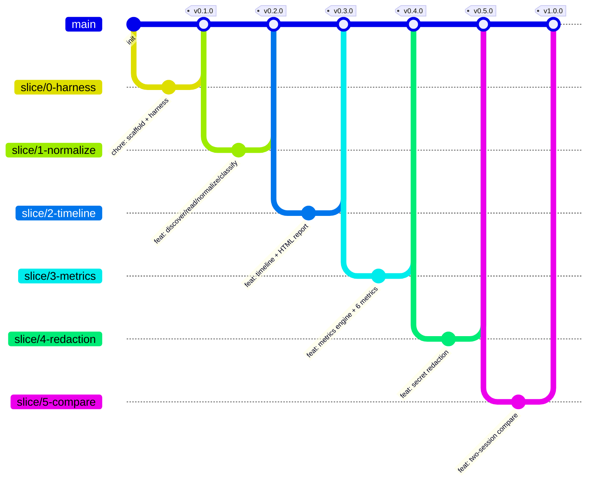

# Glassbox Implementation Plan

> **For agentic workers:** REQUIRED: Use the `subagent-driven-development` agent (recommended) or `executing-plans` agent to implement this plan task-by-task. Steps use checkbox (`- [ ]`) syntax for tracking. Implement phases in order; each phase's **Definition of Done** gates the next.

**Goal:** Build Glassbox — a local, read-only Claude Code session observer (CLI) that parses JSONL transcripts and renders a self-contained HTML report with a chronological timeline and a six-metric behavioural scorecard.

**Architecture:** Plain ESM JavaScript, no build step, Node built-ins only. Strict one-way layering: `discover → read → normalize → classify → timeline → metrics → render`. All raw-schema knowledge is confined to `normalize.js` (the single normalization boundary). The tool is itself built *under* a minimal harness (`CLAUDE.md`, `PROGRESS.md`, `verify.ps1`/`verify.sh`) per OBJ-5.

**Tech Stack:** Node.js (current LTS), ESM modules, `node:test`, `util.parseArgs`, `fs`/`path`/`os`/`readline`. Zero third-party runtime dependencies.

**Authoritative sources:** [docs/Glassbox_TSD.md](Glassbox_TSD.md) (primary), [docs/Glassbox_BRD.md](Glassbox_BRD.md) (requirements/trace IDs).

---

## 1. Overview & Goals

Glassbox turns invisible agent behaviour into observable measurements. Given a completed Claude Code session transcript, it produces:

1. A **timeline** of what the agent did (messages, tool calls, results), and
2. A **scorecard** grading the session against six harness-health failure modes:
   - **Grep vs Semantic** (BR-04) — text search vs LSP navigation ratio.
   - **Early Victory** (BR-05) — completion claimed without a passing verification afterward.
   - **Verification Density** (BR-06) — edits per successful test/lint/build.
   - **Overreach** (BR-07) — distinct files changed vs intended scope.
   - **Continuity** (BR-08) — was the state/progress file read before editing.
   - **Loop Detection** (BR-09) — repeated identical tool calls / repeated edits.

**Hard constraints (do not violate):**
- No build/transpile step — runnable via `node bin/glassbox.js` (NFR-02, CON-04).
- Zero/near-zero runtime dependencies — Node built-ins only (NFR-03).
- Local-only, passive, read-only. **No** `http`/`https`/`net`/`dns` imports anywhere; tests assert their absence (NFR-01, AC-11, RSK-04).
- Graceful degradation: missing fields → `"unknown"`/`null`, never crash (BR-13, NFR-05).
- We are **already inside** the `glassbox` repo root. Do **not** create a nested `glassbox/` subfolder — `src/`, `bin/`, `test/` live at the repo root.

---

## 2. Repository Layout (target tree — rooted at repo root)

```
glassbox/                      # <- repo root = e:\Projects and Learning\glassbox (DO NOT nest)
  package.json                 # type: module, bin entry, no build scripts
  bin/
    glassbox.js                # thin shebang wrapper -> src/cli.js
  src/
    cli.js                     # arg parsing, command dispatch (Slice 0/2/5)
    config.js                  # defaults, classification tables, secret/verify/completion/state patterns
    discover.js                # OS-aware transcript location (Slice 1)
    read.js                    # streaming JSONL reader, bad-line counting (Slice 1)
    normalize.js               # raw line -> Event[] (Slice 1) — SINGLE schema boundary
    classify.js                # tool name -> category + targets + command (Slice 1)
    timeline.js                # Event[] -> ordered Timeline model (Slice 2)
    metrics/
      index.js                 # REGISTRY + runAll() (Slice 3)
      helpers.js               # stableStringify, successOf, taskSegments (Slice 3)
      grepSemantic.js          # BR-04 (Slice 3)
      earlyVictory.js          # BR-05 (Slice 3)
      verificationDensity.js   # BR-06 (Slice 3)
      overreach.js             # BR-07 (Slice 3)
      continuity.js            # BR-08 (Slice 3)
      loopDetection.js         # BR-09 (Slice 3)
    redact.js                  # secret redaction (Slice 4)
    render/
      template.js              # HTML scaffold, inline CSS/JS only (Slice 2/4)
      report.js                # single-session report assembly (Slice 2/3/4)
      compare.js               # two-session side-by-side (Slice 5)
  test/
    fixtures/                  # synthetic + one sanitized real transcript
    *.test.js                  # node:test suites
  docs/
    Glassbox_BRD.md
    Glassbox_TSD.md
    Glassbox_Implementation_Plan.md
  CLAUDE.md                    # harness instruction file (Slice 0, OBJ-5)
  PROGRESS.md                  # harness state file (Slice 0, OBJ-5)
  verify.ps1                   # harness verify command — Windows (Slice 0, OBJ-5)
  verify.sh                    # harness verify command — POSIX (Slice 0, OBJ-5)
  .gitignore
  README.md
```

---

## 3. Phased Implementation

Each phase maps to one TSD vertical slice and one feature branch (see §4). Build phases in order. Do not start a phase until the previous phase's **Definition of Done** is met, merged to `main`, and tagged.

---

### Phase 0 — Harness & Project Skeleton

**Slice:** 0 · **Branch:** `slice/0-harness` · **Tag on merge:** `v0.1.0`

**Goal.** Stand up the minimal harness the tool is built *under* (OBJ-5) and a runnable empty CLI.

**BRD trace:** OBJ-4, OBJ-5, CON-03, CON-04, NFR-02, NFR-03, DEP-01.

**Files to create:**
- Create: `package.json`
- Create: `bin/glassbox.js`
- Create: `src/cli.js` (stub)
- Create: `CLAUDE.md`
- Create: `PROGRESS.md`
- Create: `verify.ps1`
- Create: `verify.sh`
- Create: `.gitignore`
- Create: `README.md`
- Create: `test/cli.smoke.test.js`

**Tasks:**

- [ ] **0.1** Initialize the repo: `git init` (if not already a repo), create `main` branch, then create and switch to `slice/0-harness`.
- [ ] **0.2** Create `package.json` with: `"type": "module"`, `"name": "glassbox"`, `"version": "0.1.0"`, `"bin": { "glassbox": "bin/glassbox.js" }`, `"scripts": { "test": "node --test", "verify": "node --test" }`, `"engines": { "node": ">=18.3" }` (minimum for `util.parseArgs` and `node:test`), **no** `dependencies`, **no** build/transpile scripts (NFR-03).
- [ ] **0.3** Create `bin/glassbox.js`: shebang `#!/usr/bin/env node`, then `import('../src/cli.js')` and invoke its `main(process.argv.slice(2))`.
- [ ] **0.4** Create `src/cli.js` stub exporting `main(argv)`: parse `--help`/`--version` with `util.parseArgs`; print version (read from `package.json` via `fs`) or usage; `process.exit(0)`. No other commands yet.
- [ ] **0.5** Create `CLAUDE.md` (harness instruction file): project purpose, the hard constraints from §1, the layering rule, the "no network imports" rule, the verify command, and a pointer to `PROGRESS.md`. (See §8 — Harness rollout note.)
- [ ] **0.6** Create `PROGRESS.md` (harness state file) with sections: `## Current Slice`, `## Confirmed Schema (Slice 1 discovery)`, `## Decisions`, `## Open Questions`, `## Done`. Pre-seed the four open technical decisions (§7).
- [ ] **0.7** Create `verify.ps1` and `verify.sh` that run (a) `node --test` and (b) a no-network grep asserting no `http`/`https`/`net`/`dns` imports under `src/`, `bin/`, `test/`. Non-zero exit if either fails (AC-11 gate).
- [ ] **0.8** Create `.gitignore` (node_modules, `*.html` report outputs, OS cruft) and a short `README.md` (what it is, `node bin/glassbox.js --help`).
- [ ] **0.9** Write `test/cli.smoke.test.js`: spawn `node bin/glassbox.js --version`, assert exit code 0 and that output matches a version string.
- [ ] **0.10** Run `node --test` locally; confirm the smoke test passes.
- [ ] **0.11** Run `verify.ps1` (Windows) / `verify.sh` (POSIX); confirm both checks pass.
- [ ] **0.12** Commit with Conventional Commits (e.g. `chore: scaffold project and harness`), open PR, ensure verify gate is green, squash-merge to `main`, delete branch, tag `v0.1.0`.

**Definition of Done (Phase 0):**
- `node bin/glassbox.js --version` prints a version and exits 0.
- `node --test` runs and passes the smoke test.
- No third-party runtime dependencies declared.
- `verify.*` runs `node --test` + no-network grep and passes.

---

### Phase 1 — Discovery, Read & Normalize + Classify (the schema boundary)

**Slice:** 1 · **Branch:** `slice/1-normalize` · **Tag on merge:** `v0.2.0`

**Goal.** Turn a real transcript on disk into a normalized, classified `Event[]`, proving the reverse-engineered schema before anything depends on it. **This phase begins with a discovery spike against a real transcript.**

**BRD trace:** BR-01, BR-02, BR-13, NFR-05, CON-01, CON-02, ASM-01, ASM-02, ASM-03, RSK-01, RSK-02, AC-01, AC-12. (Open Questions 1, 3, 4.)

**Files to create/modify:**
- Create: `src/discover.js`
- Create: `src/read.js`
- Create: `src/normalize.js`
- Create: `src/classify.js`
- Create: `src/config.js`
- Modify: `src/cli.js` (wire partial pipeline + `--json`)
- Modify: `PROGRESS.md` (record confirmed schema)
- Create: `test/fixtures/clean.jsonl`, `test/fixtures/malformed.jsonl`, `test/fixtures/real-sanitized.jsonl`
- Create: `test/read.test.js`, `test/normalize.test.js`, `test/classify.test.js`, `test/discover.test.js`

**Tasks:**

- [ ] **1.1 — DISCOVERY SPIKE (do first).** Locate the real Claude Code transcript directory on the dev machine (Windows: `%APPDATA%`, `%USERPROFILE%/.claude`, `%USERPROFILE%/.config/claude`; POSIX: `~/.claude`, `~/.config/claude`, `$XDG_CONFIG_HOME/claude`). Open one real `.jsonl`. Record in `PROGRESS.md` under "Confirmed Schema": exact field names for role/type, tool-use block shape, tool-result block shape, timestamp field(s), and the `toolUseId` correlation field. (ASM-02/03, Open Question 1.)
- [ ] **1.2** Create a **sanitized** copy of one real transcript at `test/fixtures/real-sanitized.jsonl` (strip secrets/PII by hand; keep structure). This is the realism fixture for integration tests.
- [ ] **1.3** Create `src/config.js` with exported plain data: `CLASSIFICATION` table (TSD §4.2), `VERIFY_PATTERNS`, `COMPLETION_PATTERNS`, `STATE_FILE_PATTERNS`, `SECRET_PATTERNS` (placeholder for Slice 4), and `DEFAULTS` (`outPath: './glassbox-report.html'`, `loopThreshold: 3`). Populate `CLASSIFICATION`/`VERIFY_PATTERNS` from §4.2 and refine with names observed in 1.1.
- [ ] **1.4** Create `src/discover.js` exporting `resolveTranscript({ path, latest })`: if `path` exists → return `{ file, source: 'arg', candidatesTried: [] }`; if `latest` → scan platform candidate roots for `*.jsonl`, return newest by mtime as `{ file, source: 'latest', candidatesTried }`. Use `os.homedir()` + platform branches (NFR-02, CON-02). Never throw on a missing candidate root.
- [ ] **1.5** Write `test/discover.test.js`: assert path-arg passthrough returns the file; assert `--latest` over a temp dir of `.jsonl` files returns the newest by mtime; assert missing roots are skipped, not thrown.
- [ ] **1.6** Create `src/read.js` exporting `streamLines(file)` using `readline` over a read stream: trim each line, skip empty, `JSON.parse` inside try/catch. Return `{ records, skipped, total }`. **Never throw on content** (NFR-05, AC-12).
- [ ] **1.7** Create `test/fixtures/clean.jsonl` (well-formed events) and `test/fixtures/malformed.jsonl` (mix of valid lines, truncated JSON, blank lines). Write `test/read.test.js`: clean fixture → `skipped===0`; malformed fixture → completes and `skipped` equals the count of bad lines.
- [ ] **1.8** Create `src/normalize.js` exporting `toEvents(records)` producing `Event[]` per TSD §3.1. Implement resilient `inferType`: explicit role/type (including `'system'` → type `'system'`) → tool-use block → tool-result block → fallback `unknown` (+warning). Expand a single assistant record containing text **and** tool-use blocks into multiple `Event`s (assistant text, then each `tool_call`), preserving monotonic `seq`. Correlate `tool_result` to `tool_call` via `toolUseId`. Extract `ts` from any of `timestamp`/`ts`/`created_at`; null if none. **Confine all schema knowledge here** (RSK-01).
- [ ] **1.9** Write `test/normalize.test.js`: assert event-type inference for user/assistant/tool_call/tool_result/unknown; assert one assistant+tools record expands to multiple `Event`s with correct `seq`; assert missing timestamp → `ts === null` and a warning recorded (BR-13).
- [ ] **1.10** Create `src/classify.js` exporting `annotate(events)`: fill `tool.category`, `tool.targets`, `tool.command` using `config.CLASSIFICATION` (exact name → regex fallback, MCP prefixes stripped, lowercased). Command-sniff shell runners against `VERIFY_PATTERNS` → `verify` else `other`. Extract targets from `input.path`/`file_path`/`filePath`/`targets[]`/`files[]` and any `*path` field; normalize to POSIX separators. Unknown names → `unknown`.
- [ ] **1.11** Write `test/classify.test.js`: assert each category resolves for representative tool names; assert a shell command matching a verify pattern → `verify` and a non-matching shell command → `other`; assert target extraction from multiple input shapes; assert unrecognized name → `unknown`.
- [ ] **1.12** Modify `src/cli.js`: add the single-session positional `<transcript>` and `--json <file>`, `--latest` options. Run `discover → read → normalize → classify`; with `--json`, write the `Event[]` plus per-type counts and `skipped` to the JSON file (AC-01 early; Open Question 4 — resolved: include `--json` in Slice 1).
- [ ] **1.13** Run the partial pipeline against `test/fixtures/real-sanitized.jsonl` with `--json`; confirm counts look sane and nothing crashes. Update `PROGRESS.md` with any schema deviations and re-tune `CLASSIFICATION` to match the real tool names observed.
- [ ] **1.14** Run `verify.*`; commit (`feat: discover, read, normalize and classify transcripts`); PR; squash-merge to `main`; delete branch; tag `v0.2.0`.

**Definition of Done (Phase 1) — AC-01, AC-12:**
- Given a real transcript, `--json` output reports counts per event type without crashing.
- Given a transcript with malformed/truncated lines, the run completes and reports the skipped count.
- `PROGRESS.md` records the confirmed on-disk path and any schema deviations (ASM-02/03).
- Classification table updated to match real tool names observed.

---

### Phase 2 — Timeline + Report Skeleton + CLI

**Slice:** 2 · **Branch:** `slice/2-timeline` · **Tag on merge:** `v0.3.0`

**Goal.** Produce a readable, self-contained HTML report with a chronological timeline, driven by a single command. Scorecard area is a placeholder (no metrics yet).

**BRD trace:** BR-03, BR-10, BR-11, NFR-04, NFR-07, AC-02, AC-09, AC-11.

**Files to create/modify:**
- Create: `src/timeline.js`
- Create: `src/render/template.js`
- Create: `src/render/report.js`
- Modify: `src/cli.js` (full single-session command + `--out`/`--open`)
- Create: `test/timeline.test.js`, `test/render.test.js`, `test/integration.report.test.js`

**Tasks:**

- [ ] **2.1** Create `src/timeline.js` exporting `build(events) → Timeline` (TSD §3.2). Map each event to a `TimelineEntry { seq, ts, kind, title, summary, badge }`: user/assistant → truncated text summary; `tool_call` → `title = tool.name`, `badge = category`, `summary` = targets/command; `tool_result` → ok/error badge + truncated output. Compute `counts`, `startTs`, `endTs`.
- [ ] **2.2** Write `test/timeline.test.js`: assert entries are chronologically ordered by `seq`; assert `counts` totals match input; assert long text is truncated; assert `startTs`/`endTs` derive from first/last non-null `ts`.
- [ ] **2.3** Create `src/render/template.js` exporting `page({ title, head, body }) → string`: a full HTML document with **inline** CSS and JS only — no external URLs, fonts, CDNs, or fetches (AC-11). Minimal styling: timeline column, colored category badges, legible without source (NFR-07).
- [ ] **2.4** Create `src/render/report.js` exporting `report({ timeline, scorecard, meta }) → string`: assemble header (transcript path, generated time, event count, skipped lines), the timeline section, and a **scorecard placeholder** section. Use `template.page(...)`.
- [ ] **2.5** Write `test/render.test.js`: render a small timeline; assert output contains the timeline entries; **assert the HTML contains no `http://`, `https://`, `//cdn`, `<link rel`, or `fetch(`** (AC-11 inline-only guarantee).
- [ ] **2.6** Modify `src/cli.js`: implement the full single-session command `discover → read → normalize → classify → timeline → render.report → fs.writeFile(out)`. Add `--out <file>` (default `DEFAULTS.outPath`) and `--open` (launch via platform opener; POSIX: `open`/`xdg-open`; Windows: `spawn('cmd', ['/c', 'start', path])` — `start` is a cmd built-in, not a standalone exe; **no** network). Exit `0` on success, `1` on unrecoverable error (file unreadable / no events).
- [ ] **2.7** Write `test/integration.report.test.js`: run the full command over `test/fixtures/real-sanitized.jsonl` to a temp output path; assert the file is written, exit code is 0, and the HTML contains the timeline and no external resource references.
- [ ] **2.8** Spot-check NFR-04: time the report generation on a typical transcript; confirm it completes in a few seconds.
- [ ] **2.9** Run `verify.*`; commit (`feat: timeline and self-contained HTML report`); PR; squash-merge to `main`; delete branch; tag `v0.3.0`.

**Definition of Done (Phase 2) — AC-02, AC-09:**
- `glassbox <transcript>` writes a self-contained HTML file in one command.
- Opening the file shows a chronological, readable timeline of session actions.
- Report generated in a few seconds for a typical transcript (NFR-04 spot-check).
- HTML contains no external resource references (grep for `http`).

---

### Phase 3 — Metrics Engine + Six Metrics

**Slice:** 3 · **Branch:** `slice/3-metrics` · **Tag on merge:** `v0.4.0`

**Goal.** Compute all six scorecard metrics as independent, pure units and attach them to the report.

**BRD trace:** BR-04, BR-05, BR-06, BR-07, BR-08, BR-09, AC-03, AC-04, AC-05, AC-06, AC-07, AC-08, NFR-06, ASM-03, ASM-04, RSK-03. (Open Question 2.)

**Files to create/modify:**
- Create: `src/metrics/index.js`, `src/metrics/helpers.js`
- Create: `src/metrics/grepSemantic.js`, `earlyVictory.js`, `verificationDensity.js`, `overreach.js`, `continuity.js`, `loopDetection.js`
- Modify: `src/render/report.js` (replace placeholder with scorecard), `src/cli.js` (`--scope`, `--threshold`)
- Create: one `test/metrics.<name>.test.js` per metric + `test/metrics.helpers.test.js`
- Create: fixtures `no-semantic.jsonl`, `no-verify.jsonl`, `looped.jsonl`, `multi-task-overreach.jsonl`

**Tasks:**

- [ ] **3.1** Create `src/metrics/helpers.js` exporting: `stableStringify(obj)` (deterministic key-sorted JSON), `successOf(resultEvent)` (derive `ok` from `exitCode===0`, `isError`, or output patterns like `FAIL`/`error`; `null` when undeterminable), `taskSegments(events)` (split at user messages → `{ start, end, userText }[]`).
- [ ] **3.2** Write `test/metrics.helpers.test.js`: assert `stableStringify` is order-independent; assert `successOf` returns true/false/null across exit code, `isError`, text-pattern, and undeterminable cases; assert `taskSegments` splits correctly at user boundaries.
- [ ] **3.3** Create `src/metrics/index.js` exporting `REGISTRY` (ordered: grepSemantic, earlyVictory, verificationDensity, overreach, continuity, loopDetection) and `runAll(events, options) → Scorecard`. Each module exports `compute(events, options) → MetricResult` (TSD §3.3). `runAll` always returns all six in fixed order.
- [ ] **3.4** Create `src/metrics/grepSemantic.js` (BR-04/AC-03): `searchCount` = events category `search`; `semanticCount` = category `semantic`; `display` shows both counts + ratio `search:semantic` (and proportion). Degraded: `semanticCount===0` → text-search-only, `status:'unknown'`, note (ASM-04/RSK-03).
- [ ] **3.5** Create `src/metrics/earlyVictory.js` (BR-05/AC-04): `lastEditSeq` = max seq of category `edit`; `postEditVerifyOk` = any `verify` result with `ok===true` at seq > `lastEditSeq`; `completionClaim` = any assistant `text` matching `COMPLETION_PATTERNS`. Raised iff `completionClaim && !postEditVerifyOk`. Degraded: no edits / no claim → not raised; undeterminable verify → note + `status:'unknown'`.
- [ ] **3.6** Create `src/metrics/verificationDensity.js` (BR-06/AC-05): `edits` = count category `edit`; `verifiesOk` = count `verify` results with `ok===true`; `display = edits + ' / ' + verifiesOk`; ratio = `edits/verifiesOk`. Degraded: `verifiesOk===0` → ratio `∞`, `status:'alert'`.
- [ ] **3.7** Create `src/metrics/overreach.js` (BR-07/AC-06): segment via `taskSegments` plus a session-level aggregate; per task `distinctFilesChanged` = unique `edit` targets; if `options.scope` globs provided, flag targets not matching any glob as out-of-scope. `display` = distinct file count (+N out-of-scope). Degraded: no scope → count only, no flags.
- [ ] **3.8** Create `src/metrics/continuity.js` (BR-08/AC-07): `firstEditSeq` = min seq of category `edit`; `stateRead` = exists a `read` event with a target matching `STATE_FILE_PATTERNS` at seq < `firstEditSeq`. Report boolean. Degraded: no edits → "n/a (no edits)"; no read data → `unknown`.
- [ ] **3.9** Create `src/metrics/loopDetection.js` (BR-09/AC-08): key each `tool_call` by `name + stableStringify(input)`; flag any key occurring ≥ `options.threshold` (default 3); separately flag any single file with ≥ threshold edit calls. `display` = number of detected loops; `detail` lists offending keys/targets.
- [ ] **3.10** Create fixtures: `test/fixtures/no-semantic.jsonl` (search but no semantic), `no-verify.jsonl` (edits, no successful verify), `looped.jsonl` (a tool call repeated ≥3×), `multi-task-overreach.jsonl` (multiple user tasks editing many files).
- [ ] **3.11** Write one test file per metric (`test/metrics.grepSemantic.test.js`, etc.) covering **both** the normal path and the degraded path. Explicitly: removing all semantic events still yields a valid BR-04 result (ASM-04 fallback); `no-verify` fixture drives `verificationDensity` to `∞`/`alert` and can raise `earlyVictory`.
- [ ] **3.12** Modify `src/render/report.js`: replace the Slice-2 placeholder with a scorecard section — one card per metric showing `label`, `display`, `explanation`, status color, and `notes` (NFR-07). Order fixed per `REGISTRY`.
- [ ] **3.13** Modify `src/cli.js`: wire `metrics.runAll(events, { scope, threshold })` into the single-session pipeline; add `--scope <glob...>` (repeatable) and `--threshold <n>` (default 3).
- [ ] **3.14** Run the full command over `real-sanitized.jsonl`; confirm all six metrics render with counts and explanations.
- [ ] **3.15** Run `verify.*`; commit (`feat: metrics engine and six behavioural metrics`); PR; squash-merge to `main`; delete branch; tag `v0.4.0`.

**Definition of Done (Phase 3) — AC-03..AC-08:**
- Each metric has unit tests over synthetic fixtures covering the normal and degraded path.
- The report shows all six metrics with counts and explanations.
- Removing all semantic events still produces a valid BR-04 result (ASM-04 fallback verified).

---

### Phase 4 — Secret Redaction

**Slice:** 4 · **Branch:** `slice/4-redaction` · **Tag on merge:** `v0.5.0`

**Goal.** Make rendered reports safe to keep/share by optionally scrubbing obvious secrets.

**BRD trace:** NFR-01, RSK-04 (privacy).

**Files to create/modify:**
- Create: `src/redact.js`
- Modify: `src/config.js` (`SECRET_PATTERNS`), `src/render/report.js` (banner/warning), `src/cli.js` (`--redact`)
- Create: `test/redact.test.js`, `test/fixtures/secrets.jsonl`

**Tasks:**

- [ ] **4.1** Populate `SECRET_PATTERNS` in `src/config.js`: OpenAI/Anthropic-style keys (`/sk-[A-Za-z0-9-_]{16,}/`, `/sk-ant-[A-Za-z0-9-_]+/`), AWS access keys (`/AKIA[0-9A-Z]{16}/`), bearer tokens, `Authorization:` headers, PEM private-key blocks, `.env`-style `KEY=value` for `*_KEY|*_TOKEN|*_SECRET|PASSWORD`, and a guarded generic high-entropy long-string rule (limit false positives). Each pattern carries a `kind` label.
- [ ] **4.2** Create `src/redact.js` exporting `scrub(text, patterns) → { text, count }` (replace matches with `«redacted:‹kind›»`) and `scrubModel(timeline, scorecard, opts) → { timeline, scorecard, count }` that walks all rendered string fields (timeline summaries, result text, metric detail) when `--redact` is set.
- [ ] **4.3** Create `test/fixtures/secrets.jsonl` with seeded secrets across the pattern categories.
- [ ] **4.4** Write `test/redact.test.js`: assert `scrub` replaces each seeded secret kind and returns an accurate count; assert `scrubModel` leaves non-secret text intact; assert no seeded secret survives into a redacted render.
- [ ] **4.5** Modify `src/render/report.js`: when redaction active, show a redaction banner + count; when **not** active, show a warning that the report may contain sensitive content (RSK-04).
- [ ] **4.6** Modify `src/cli.js`: add `--redact`; when set, call `scrubModel` before render.
- [ ] **4.7** Integration check: render `secrets.jsonl` with `--redact` and assert the HTML contains no seeded secret and shows the count; render without `--redact` and assert the sensitivity warning appears.
- [ ] **4.8** Run `verify.*`; commit (`feat: optional secret redaction`); PR; squash-merge to `main`; delete branch; tag `v0.5.0`.

**Definition of Done (Phase 4):**
- With `--redact`, seeded secrets in a fixture transcript do not appear in the HTML; count shown.
- Without `--redact`, the report renders and displays the sensitivity warning.

---

### Phase 5 — Two-Session Comparison

**Slice:** 5 · **Branch:** `slice/5-compare` · **Tag on merge:** `v1.0.0`

**Goal.** Render two sessions side-by-side on the same six metrics to evaluate harness changes.

**BRD trace:** BR-12, OBJ-3, AC-10.

**Files to create/modify:**
- Create: `src/render/compare.js`
- Modify: `src/cli.js` (`compare <a> <b>` command)
- Create: `test/integration.compare.test.js`

**Tasks:**

- [ ] **5.1** Modify `src/cli.js`: add `compare <a> <b>` — run the full pipeline (`discover → read → normalize → classify → timeline → metrics`) independently for each session, producing two `Scorecard`s and two `Timeline`s. `--redact`, `--scope`, `--threshold` apply to **both** sessions.
- [ ] **5.2** Create `src/render/compare.js` exporting `compare({ a, b, meta }) → string` reusing `render/template.js`: render a metrics table (rows = six metrics, columns = Session A / Session B) plus a **delta column** where numeric (verification density change, overreach change, loop count change) with direction labels (improvement / regression). [TSD extension beyond BRD "basic side-by-side"; extends AC-10, does not conflict.] Optionally render both timelines in collapsible columns.
- [ ] **5.3** Write `test/integration.compare.test.js`: run `compare` over two fixtures (e.g. `real-sanitized.jsonl` and `no-verify.jsonl`); assert one HTML page is produced comparing all six metrics; assert numeric deltas are correct and direction-labelled; assert no external resource references (AC-11).
- [ ] **5.4** Run the command `glassbox compare a.jsonl b.jsonl`; visually confirm the side-by-side table and deltas.
- [ ] **5.5** Update `README.md` with full usage (single-session, `compare`, all flags) and `PROGRESS.md` (mark all slices Done).
- [ ] **5.6** Run `verify.*`; commit (`feat: two-session comparison report`); PR; squash-merge to `main`; delete branch; tag `v1.0.0`.

**Definition of Done (Phase 5) — AC-10:**
- `glassbox compare a.jsonl b.jsonl` produces one HTML page comparing both on all six metrics.
- Numeric deltas are correct and direction-labelled (improvement vs regression where meaningful).

---

## 4. Branching Strategy

**Model:** Trunk-based development with short-lived feature branches. `main` is always releasable and green (verify gate passes).

**Branch naming:**
- One feature branch per slice: `slice/0-harness`, `slice/1-normalize`, `slice/2-timeline`, `slice/3-metrics`, `slice/4-redaction`, `slice/5-compare`.
- Bug fixes: `fix/<short-description>` (e.g. `fix/malformed-line-skip`).
- Chores/tooling/docs: `chore/<short>` (e.g. `chore/update-readme`).

**Commit convention:** [Conventional Commits](https://www.conventionalcommits.org/) — `feat:`, `fix:`, `test:`, `docs:`, `chore:`, `refactor:`. Scope optional (e.g. `feat(metrics): add loop detection`).

**Merge gate (PR):** `verify.ps1` / `verify.sh` must pass — `node --test` (all suites green) **and** the no-network grep (no `http`/`https`/`net`/`dns` imports) — before merge (AC-11, NFR-05).

**Merge mechanics:** Squash-merge to `main` (one tidy commit per slice). Delete the feature branch after merge.

**Release tagging:** Tag `main` per slice completion, slice-aligned: `v0.1.0` (Phase 0) … `v0.4.0` (Phase 3), `v0.5.0` (Phase 4), `v1.0.0` (Phase 5, feature-complete).

**Workflow:**



---

## 5. Definition of Done & Verification

**Global DoD (applies to every merge to `main`):**
- All `node:test` suites pass (`node --test`).
- No `http`/`https`/`net`/`dns` imports anywhere under `src/`, `bin/`, `test/` (AC-11).
- No third-party runtime dependencies introduced (NFR-03).
- No build/transpile step required — runs via `node bin/glassbox.js` (NFR-02).
- The current slice's specific DoD (above) is satisfied.
- `PROGRESS.md` updated to reflect the completed slice.

**Verify command (the harness verify, OBJ-5):**
- Windows: `pwsh ./verify.ps1` · POSIX: `./verify.sh`
- Each runs: (1) `node --test`, and (2) a grep asserting no network-module imports. Non-zero exit fails the gate.

**Test strategy (TSD §8):**

| Layer | Tool | Coverage |
|---|---|---|
| Unit | `node:test` | `normalize`, `classify`, each metric (normal + degraded), `redact`, `stableStringify`, `successOf`. |
| Fixtures | `test/fixtures/` | Synthetic JSONL: clean, malformed, no-semantic, no-verify, looped, seeded secrets, multi-task overreach. Plus one **sanitized real** transcript (captured in Phase 1). |
| Integration | `node:test` | Full pipeline per command (`report`, `compare`) asserting output structure and counts. |
| Privacy | `node:test` + grep | No `http/https/net/dns` imports; generated HTML has no external URLs (AC-11). |
| Robustness | `node:test` | Malformed-line fixture completes and reports skip count (AC-12). |
| Performance | manual/CI timer | Typical transcript report under the NFR-04 budget. |

---

## 6. Traceability (Phase → BRD/NFR/AC/OBJ/RSK)

| Phase / Slice | Branch | BR | NFR | AC | OBJ | RSK / Other |
|---|---|---|---|---|---|---|
| 0 — Harness | `slice/0-harness` | — | NFR-02, NFR-03 | — | OBJ-4, OBJ-5 | CON-03, CON-04, DEP-01 |
| 1 — Normalize | `slice/1-normalize` | BR-01, BR-02, BR-13 | NFR-05 | AC-01, AC-12 | OBJ-1 (partial) | CON-01, CON-02, ASM-01/02/03, RSK-01/02; OQ-1/3/4 |
| 2 — Timeline | `slice/2-timeline` | BR-03, BR-10, BR-11 | NFR-04, NFR-07 | AC-02, AC-09, AC-11 | OBJ-1 | — |
| 3 — Metrics | `slice/3-metrics` | BR-04..BR-09 | NFR-06 | AC-03..AC-08 | OBJ-2 | ASM-03/04, RSK-03; OQ-2 |
| 4 — Redaction | `slice/4-redaction` | — | NFR-01 | AC-11 (reinforced) | — | RSK-04 |
| 5 — Compare | `slice/5-compare` | BR-12 | — | AC-10 | OBJ-3 | RSK-05 boundary held |

> Cross-cutting throughout: **RSK-01/02** mitigated by the single normalization boundary (`normalize.js`) and discovery-first sequencing; **RSK-05** (scope creep) bounded by the six-slice plan and BRD §4.2 out-of-scope (no storage, no multi-session analytics, no service). **ASM-05** is context only — no performance claim is made.

---

## 7. Open Technical Decisions (resolve during Phase 1 / Slice 1)

Record resolutions in `PROGRESS.md` as they are confirmed:

1. **Confirmed transcript schema** — exact field names for role/type, tool-use, tool-result, and timestamp; update `normalize.js` and `CLASSIFICATION` accordingly (ASM-02/03, OQ-1).
2. **Semantic tool identity** — which tool names (if any) represent LSP navigation in the user's setup; if none, BR-04 runs in text-search-only mode (ASM-04/RSK-03, OQ-3).
3. **Task-scope availability** — whether transcripts encode intended scope for BR-07, or whether `--scope` must always supply it. Default design assumes `--scope` (OQ-2).
4. **Verify-success signal** — the most reliable cross-tool way to read a "passing" verification (exit code vs output text); refine `successOf` once real results are observed.

---

## 8. Workflow / Harness Rollout Note

The harness the tool is built *under* (OBJ-5) is produced in **Phase 0**, not as a separate effort:

- **`CLAUDE.md`** (repo root) — instruction file: project purpose, the hard constraints (§1), the strict layering rule, the no-network-imports rule, the verify command, and a pointer to `PROGRESS.md`.
- **`PROGRESS.md`** (repo root) — state file: current slice, confirmed schema (Phase 1 discovery), decisions, open questions, and done log.
- **`verify.ps1` / `verify.sh`** (repo root) — the verify command gating every merge (`node --test` + no-network grep).
- **Branching docs** — this plan's §4 is the source of truth; optionally mirror a short summary in `README.md` or `.github/` (e.g. a PR template/checklist referencing the verify gate). Any agent/skill/rule helper files, if used, live alongside `CLAUDE.md` at the root (or under `.github/`).

These files are pointers/coordination only — they are created as ordinary tasks within Phase 0 and updated each phase; the application code itself lives under `src/`, `bin/`, `test/`.
